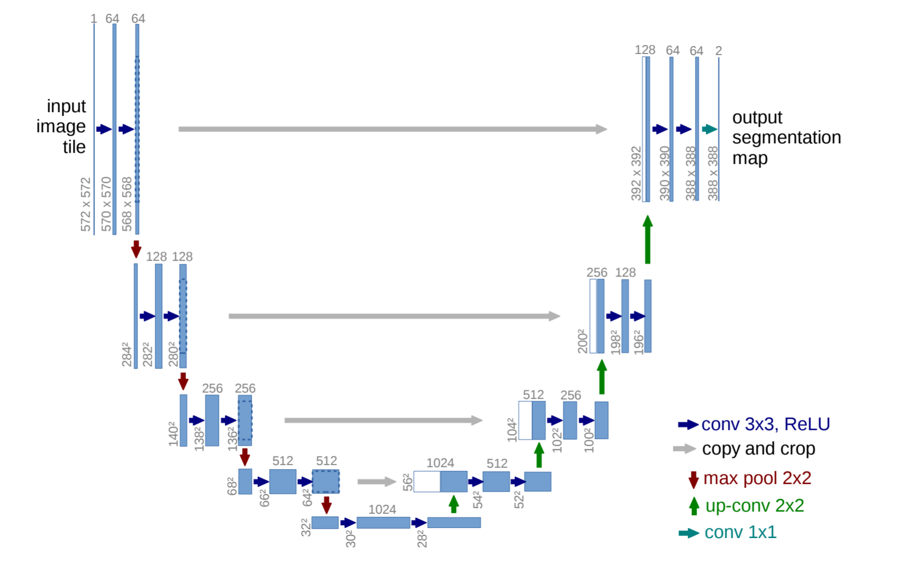
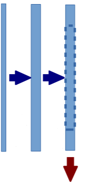
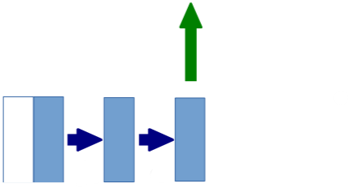

# UNet的pytorch实现

## 1.概述

[原文](https://arxiv.org/pdf/1505.04597v1.pdf)

[本文实现](https://github.com/Lizi2hua/Unet_toy.git)

UNet是医学图像分割领域经典的论文，因其结构像字母`U`得名。



倘若了解过`Encoder-Decoder`结构、实现过`DenseNet`，那么实现`Unet`并非难事。

> 1.首先，图中的灰色箭头（copy and crop）目的是将浅层特征与深层特征融合，这样可以既保留浅层特征图中较高精度的特征信息，也可以利用深层特征图中抽象的语义信息。
>
> 2.其次，在下采样过程中，特征图缩小的尺度是上一层的一半；而在上采样过程中特征图变为上一层的一倍。通道数量变化相反。
>
> 3.下采样的时候卷积层特征尺度变化小，原论文使用max pooling进行尺度缩小；上采样也一样，使用upsampling+conv进行尺度增大。

对于下采样过程，可以让卷积不对特征图进行尺度变化，只让max pooling进行尺度变换，上采样也是。

不过本文的实现和原论文一些不同:

1. 考虑到max pooling会丢失位置信息，决定使用卷积代替它；
2. 使用**转置卷积**替代简单的上采样（插值），这样既能实现同样的效果，也能加深网络。

## 2.实现细节

### 2.1下采样过程

对于整个下采样过程，可以看作由如下的结构组成(`conv-conv-down`)。不过在进行第二次卷积时，它的输出有两个方向，一个是给下采样层，一个是传入深层。



```python
class DownsampleLayer(nn.Module):
    def __init__(self,in_ch,out_ch):
        super(DownsampleLayer, self).__init__()
        self.Conv_BN_ReLU_2=nn.Sequential(
            nn.Conv2d(in_channels=in_ch,out_channels=out_ch,kernel_size=3,stride=1,padding=1),
            nn.BatchNorm2d(out_ch),
            nn.ReLU(),
            nn.Conv2d(in_channels=out_ch, out_channels=out_ch, kernel_size=3, stride=1,padding=1),
            nn.BatchNorm2d(out_ch),
            nn.ReLU()
        )
        self.downsample=nn.Sequential(
            nn.Conv2d(in_channels=out_ch,out_channels=out_ch,kernel_size=3,stride=2,padding=1),
            nn.BatchNorm2d(out_ch),
            nn.ReLU()
        )

    def forward(self,x):
        """
        :param x:
        :return: out输出到深层，out_2输入到下一层，
        """
        out=self.Conv_BN_ReLU_2(x)
        out_2=self.downsample(out)
        return out,out_2
```

### 2.2上采样过程

上采样过程和下采样过程一样，不过输出通道是浅层和上一层的叠加，卷积过程输出通道是上采样层的2倍。



```python
class UpSampleLayer(nn.Module):
    def __init__(self,in_ch,out_ch):
        # 512-1024-512
        # 1024-512-256
        # 512-256-128
        # 256-128-64
        super(UpSampleLayer, self).__init__()
        self.Conv_BN_ReLU_2 = nn.Sequential(
            nn.Conv2d(in_channels=in_ch, out_channels=out_ch*2, kernel_size=3, stride=1,padding=1),
            nn.BatchNorm2d(out_ch*2),
            nn.ReLU(),
            nn.Conv2d(in_channels=out_ch*2, out_channels=out_ch*2, kernel_size=3, stride=1,padding=1),
            nn.BatchNorm2d(out_ch*2),
            nn.ReLU()
        )
        self.upsample=nn.Sequential(
            nn.ConvTranspose2d(in_channels=out_ch*2,out_channels=out_ch,kernel_size=3,stride=2,padding=1,output_padding=1),
            nn.BatchNorm2d(out_ch),
            nn.ReLU()
        )

    def forward(self,x,out):
        '''
        :param x: 输入卷积层
        :param out:与上采样层进行cat
        :return:
        '''
        x_out=self.Conv_BN_ReLU_2(x)
        x_out=self.upsample(x_out)
        cat_out=torch.cat((x_out,out),dim=1)
        return cat_out
```

### 2.3定义UNet

除了最后`conv-conv-conv`过程外，其他的步骤都已经在上面定义好了。于是，UNet定义为了下面的样子。

```python
class UNet(nn.Module):
    def __init__(self):
        super(UNet, self).__init__()
        out_channels=[2**(i+6) for i in range(5)] #[64, 128, 256, 512, 1024]
        #下采样
        self.d1=DownsampleLayer(3,out_channels[0])#3-64
        self.d2=DownsampleLayer(out_channels[0],out_channels[1])#64-128
        self.d3=DownsampleLayer(out_channels[1],out_channels[2])#128-256
        self.d4=DownsampleLayer(out_channels[2],out_channels[3])#256-512
        #上采样
        self.u1=UpSampleLayer(out_channels[3],out_channels[3])#512-1024-512
        self.u2=UpSampleLayer(out_channels[4],out_channels[2])#1024-512-256
        self.u3=UpSampleLayer(out_channels[3],out_channels[1])#512-256-128
        self.u4=UpSampleLayer(out_channels[2],out_channels[0])#256-128-64
        #输出
        self.o=nn.Sequential(
            nn.Conv2d(out_channels[1],out_channels[0],kernel_size=3,stride=1,padding=1),
            nn.BatchNorm2d(out_channels[0]),
            nn.ReLU(),
            nn.Conv2d(out_channels[0], out_channels[0], kernel_size=3, stride=1, padding=1),
            nn.BatchNorm2d(out_channels[0]),
            nn.ReLU(),
            nn.Conv2d(out_channels[0],3,3,1,1),
            nn.Sigmoid(),
            # BCELoss
        )
    def forward(self,x):
        out_1,out1=self.d1(x)
        out_2,out2=self.d2(out1)
        out_3,out3=self.d3(out2)
        out_4,out4=self.d4(out3)
        out5=self.u1(out4,out_4)
        out6=self.u2(out5,out_3)
        out7=self.u3(out6,out_2)
        out8=self.u4(out7,out_1)
        out=self.o(out8)
        return out
```

### 3.验证

最后写一个简单的训练程序验证一下效果。

使用$VOC \ 2012$数据集里面的语义分割数据，2913张标注好的图片。训练一个过拟合版本，使用**训练数据集中的某一张作为验证数据**。

`dataset.py`:

```python
class SEGData(Dataset):
    def __init__(self):
        '''
        根据标注文件去取图片
        '''
        self.img_path=IMG_PATH
        self.label_path=SEGLABE_PATH
        self.label_data=os.listdir(self.label_path)
        self.totensor=torchvision.transforms.ToTensor()
        self.resizer=torchvision.transforms.Resize((256,256))
    def __len__(self):
        return len(self.label_data)
    def __getitem__(self, item):
        '''
        由于输出的图片的尺寸不同，我们需要转换为相同大小的图片。首先转换为正方形图片，然后缩放的同样尺度(256*256)。
        否则dataloader会报错。
        '''
        # 取出图片路径
        img_name = os.path.join(self.label_path, self.label_data[item])
        img_name = os.path.split(img_name)
        img_name = img_name[-1]
        img_name = img_name.split('.')
        img_name = img_name[0] + '.jpg'
        img_data = os.path.join(self.img_path, img_name)
        label_data = os.path.join(self.label_path, self.label_data[item])
        # 将图片和标签都转为正方形
        img = Image.open(img_data)
        label = Image.open(label_data)
        w, h = img.size
        # 以最长边为基准，生成全0正方形矩阵
        slide = max(h, w)
        black_img = torchvision.transforms.ToPILImage()(torch.zeros(3, slide, slide))
        black_label = torchvision.transforms.ToPILImage()(torch.zeros(3, slide, slide))
        black_img.paste(img, (0, 0, int(w), int(h)))  # patse在图中央和在左上角是一样的
        black_label.paste(label, (0, 0, int(w), int(h)))
        # 变为tensor,转换为统一大小256*256
        img = self.resizer(black_img)
        label = self.resizer(black_label)
        img = self.totensor(img)
        label = self.totensor(label)
        return img,label
```

`train.py`:

```python
net = UNet().cuda()
optimizer = torch.optim.Adam(net.parameters())
loss_func = nn.BCELoss()
data=SEGData()
dataloader = DataLoader(data, batch_size=BATCH_SIZE, shuffle=True,num_workers=0,drop_last=True)
summary=SummaryWriter(r'Log')
EPOCH=1000
print('load net')
net.load_state_dict(torch.load('SAVE/Unet.pt'))
print('load success')
for epoch in range(EPOCH):
    print('开始第{}轮'.format(epoch))
    net.train()
    for i,(img,label) in  enumerate(dataloader):
        img=img.cuda()
        label=label.cuda()
        img_out=net(img)
        loss=loss_func(img_out,label)
        optimizer.zero_grad()
        loss.backward()
        optimizer.step()
        
        summary.add_scalar('bceloss',loss,i)
    torch.save(net.state_dict(),r'SAVE/Unet.pt')
    img,label=data[90]
    img=torch.unsqueeze(img,dim=0).cuda()
    net.eval()
    out=net(img)
    save_image(out, 'Log_imgs/segimg_ep{}_90th_pic.jpg'.format(epoch,i), nrow=1, scale_each=True)
    print('第{}轮结束'.format(epoch))
```


